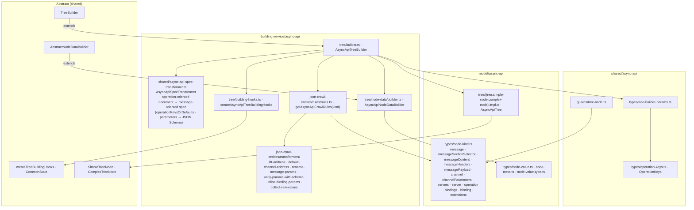

# AsyncAPI — data model, plain

Paths are relative to `packages/next-data-model/src/`. Abstract layer:
[../../shared/architecture/data-model-plain.md](../../shared/architecture/data-model-plain.md).

## Notes

- The tree root is the **message**; the section selector groups `messageContent`, `channel`, and
  `operation`.
- Headers, payload, and channel parameters keep raw schemas; bindings and extensions keep raw
  values. Nested trees for them are built by the JSON Schema and JSO builders inside the viewer.
- Row visibility is not in the data model yet (`shouldBeDisplayed` lives in the viewer).
