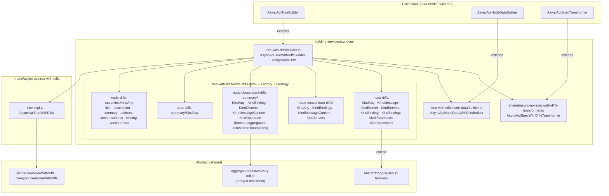

# AsyncAPI — data model, with diffs

Paths are relative to `packages/next-data-model/src/`. Abstract layer:
[../../shared/architecture/data-model-with-diffs.md](../../shared/architecture/data-model-with-diffs.md).

## Notes

- Bindings, extensions, headers, payload, and parameters are separate trees in the viewer. The
  forward descendant-summary aggregators read `aggregatedDiffsMetaKey` from the merged document so
  that changes inside those trees still mark their AsyncAPI ancestors.
- Section headers (`Address Parameters`, `Bindings`, `Servers`, `Extensions`) follow
  [../../shared/features/section-header-colorizing.md](../../shared/features/section-header-colorizing.md).
