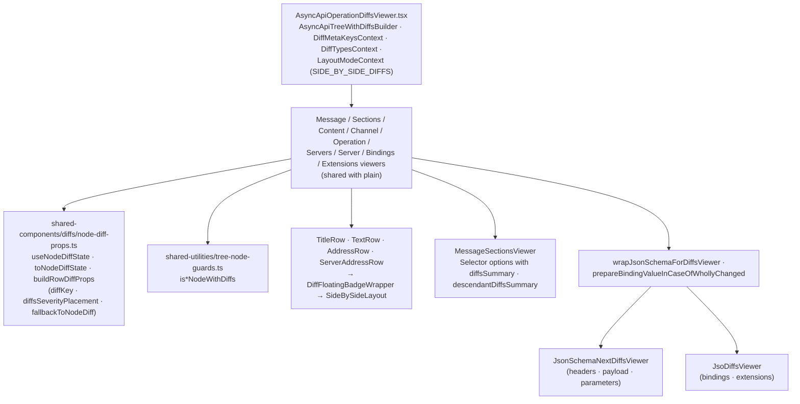

# AsyncAPI — viewer, with diffs

Paths are relative to `packages/api-doc-viewer/src/components/AsyncApiOperationViewer/`. Abstract
layer: [../../shared/architecture/viewer-with-diffs.md](../../shared/architecture/viewer-with-diffs.md).

AsyncAPI has **no separate with-diffs node viewers**: the plain components (see
[viewer-plain.md](viewer-plain.md)) detect with-diffs nodes and add diff props. Only the root,
the providers, and the nested viewers differ.

## Notes

- A wholly added or removed binding or schema is wrapped so the nested viewer receives a merged
  value with the node-level diff attached at its root.
- `JsoDiffsViewer` installs its own contexts, so AsyncAPI-level filters do not reach bindings and
  extensions.
