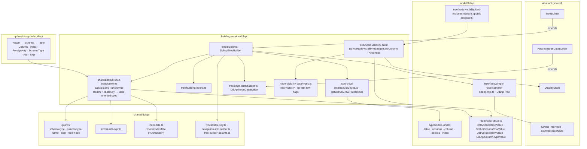

# DDL API — data model, plain

Paths are relative to `packages/next-data-model/src/`. Abstract layer:
[../../shared/architecture/data-model-plain.md](../../shared/architecture/data-model-plain.md).

## Notes

- The transformer does all ddlapi interpretation (badges, FK targets, type labels, formatted
  expressions); the tree only reshapes the table-oriented spec into nodes.
- Row visibility and list-last-row flags come from the visibility managers, not from JSX.
