# DDL API — data model, with diffs

Paths are relative to `packages/next-data-model/src/`. Abstract layer:
[../../shared/architecture/data-model-with-diffs.md](../../shared/architecture/data-model-with-diffs.md).

```mermaid
flowchart TB
  subgraph ABS["Abstract (shared)"]
    AggAbs["Abstract*Aggregator (5 families)"]
    Highlight["DIFF_HIGHLIGHTING_MODES_DDL_FLAG_BADGE_SIDE_VISIBILITY_ONLY"]
    NodesDAbs["SimpleTreeNodeWithDiffs · ComplexTreeNodeWithDiffs"]
    ListSide["list-side-display.ts"]
  end

  subgraph PLAIN["Plain stack (data-model-plain.md)"]
    Transformer["DdlApiSpecTransformer"]
    Builder["DdlApiTreeBuilder"]
    NodeData["DdlApiNodeDataBuilder"]
    VisPlain["DdlApiNodeVisibilityManagerKindColumn · KindIndex (plain)"]
  end

  subgraph BSD["building-service/ddlapi"]
    TransformerD["shared/ddlapi-spec-with-diffs-transformer.ts<br/>DdlApiSpecWithDiffsTransformer<br/>maps merged ddlapi diffs onto row fields"]
    BuilderD["tree-with-diffs/builder.ts · DdlApiTreeWithDiffsBuilder"]
    NodeDataD["tree-with-diffs/node-data/builder.ts · DdlApiNodeDataWithDiffsBuilder"]
    subgraph AGG["tree-with-diffs/node-diffs-data — Factory + Strategy"]
      Diffs["node-diffs/<br/>KindAny · KindTable · KindColumn · KindIndex · KindPropertyListSection"]
      DescDiffs["node-descendant-diffs/<br/>KindAny · KindTable · KindPropertyListSection"]
      Severities["node-diffs-severities/<br/>KindAny · KindTable · KindColumn · KindIndex"]
      Summary["node-diffs-summary/KindAny"]
      DescSummary["node-descendant-diffs-summary/KindAny"]
      Uniform["shared/property-list-section-diff-utils.ts<br/>aggregateUniformWholeNodeDescendantDiff"]
    end
    VisD["tree-with-diffs/node-visibility-data/<br/>kind-column · kind-index (diff-aware)"]
  end

  subgraph MODELD["model/ddlapi/tree-with-diffs"]
    RowDiffs["property-row-diffs.ts · DdlApiRowDiffs<br/>(Table · PropertyRow · Column · ColumnEnumValues · ColumnDefaultValue …)"]
    TypeLabel["column-type-label-diffs.ts · DdlColumnTypeLabelResolver"]
    PartNames["index-part-name-diffs.ts · DdlIndexPartNamesResolver"]
    TreeD["tree.impl.ts · DdlApiTreeWithDiffs"]
  end

  Transformer -->|extends| TransformerD
  Builder -->|extends| BuilderD
  NodeData -->|extends| NodeDataD
  BuilderD --> TransformerD
  BuilderD --> NodeDataD
  BuilderD --> Diffs
  BuilderD --> DescDiffs
  BuilderD --> Severities
  BuilderD --> Summary
  BuilderD --> DescSummary
  Diffs -->|extend| AggAbs
  Diffs --> Uniform
  Diffs --> Highlight
  VisD --> VisPlain
  BuilderD --> TreeD
  TreeD --> NodesDAbs
  RowDiffs --> TypeLabel
  RowDiffs --> PartNames
  RowDiffs --> ListSide
```

## Notes

- Flags stay stable for FK target replacement and generated-kind switches; only the target or
  expression diff is emitted.
- `Columns` / `Indexes` headers follow
  [../../shared/features/section-header-colorizing.md](../../shared/features/section-header-colorizing.md).
