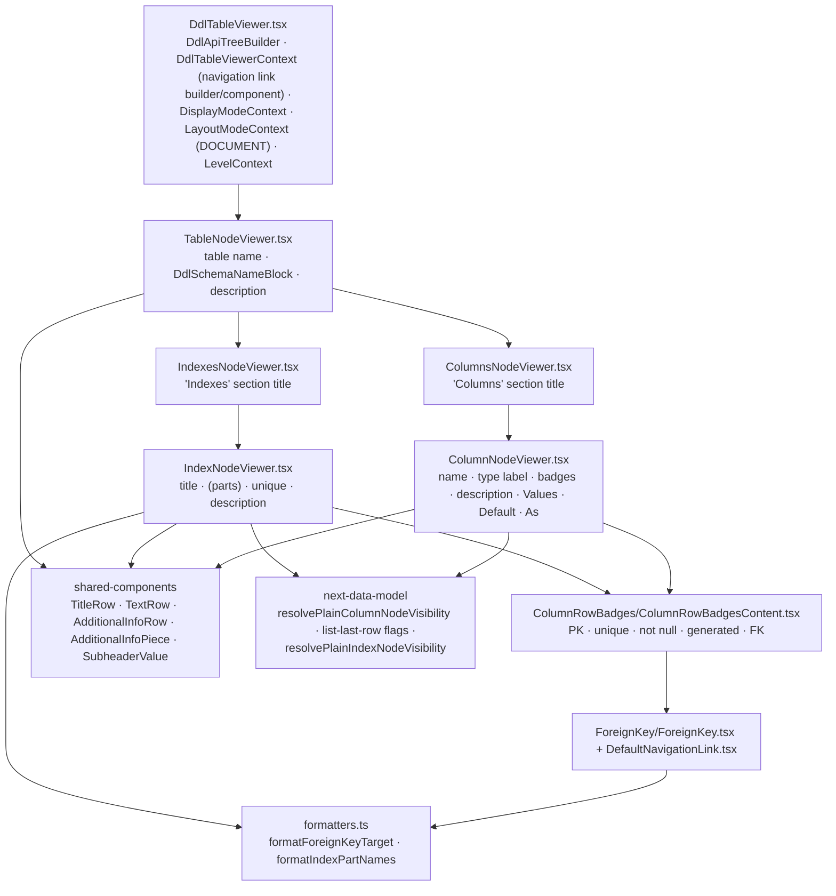

# DDL API — viewer, plain

Paths are relative to `packages/api-doc-viewer/src/components/DdlTableViewer/`. Abstract layer:
[../../shared/architecture/viewer-plain.md](../../shared/architecture/viewer-plain.md).

