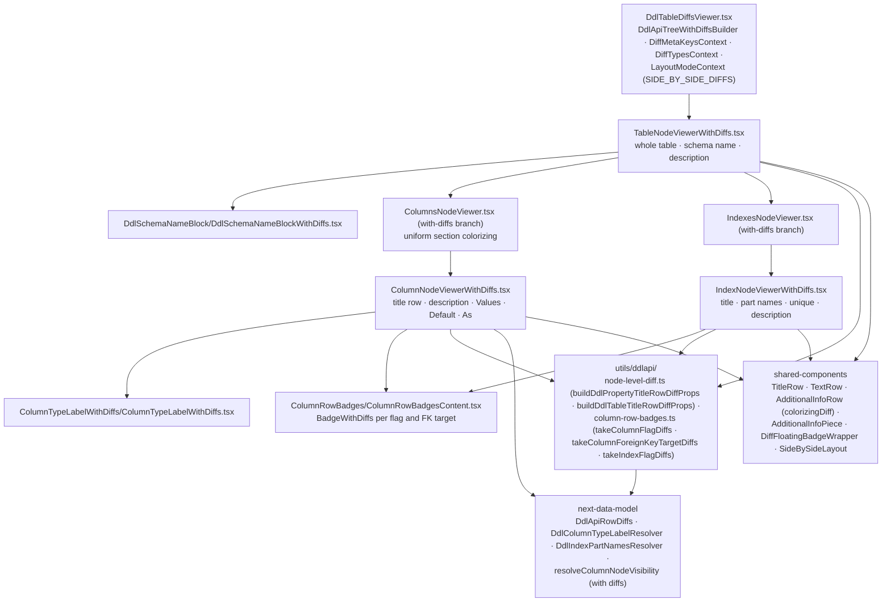

# DDL API — viewer, with diffs

Paths are relative to `packages/api-doc-viewer/src/components/DdlTableViewer/`. Abstract layer:
[../../shared/architecture/viewer-with-diffs.md](../../shared/architecture/viewer-with-diffs.md).

