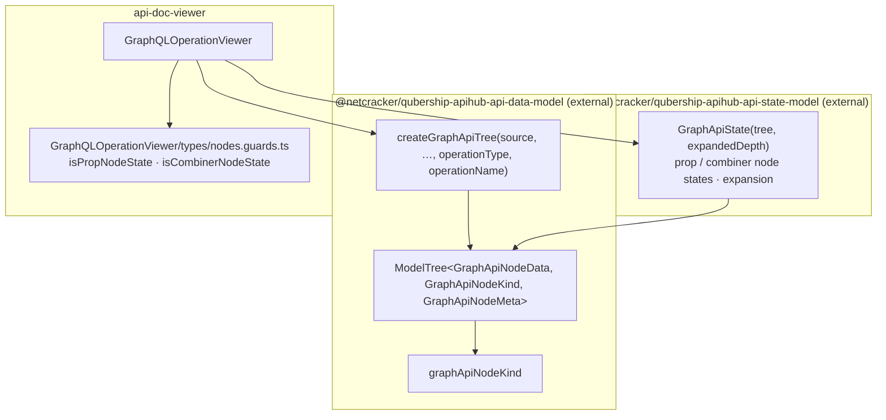

# GraphQL (legacy) — data model, plain

**Legacy.** GraphQL does not use `next-data-model`. Its tree comes from the external
`@netcracker/qubership-apihub-api-data-model` package and its expansion state from
`@netcracker/qubership-apihub-api-state-model`. Do not change without explicit approval; do not use
as a pattern for new API types.

Compare with the next stack: [../../shared/architecture/data-model-plain.md](../../shared/architecture/data-model-plain.md).
