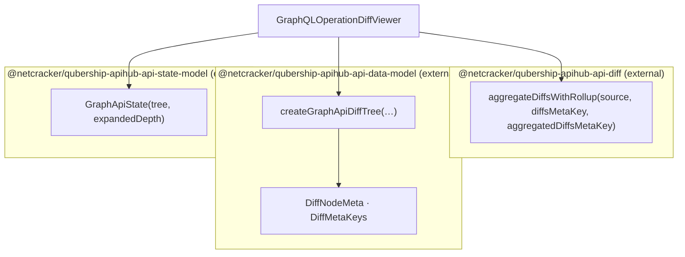

# GraphQL (legacy) — data model, with diffs

**Legacy.** Diffs are rolled up by `api-diff` and attached to an external diff tree; the viewer
passes the result to the state model with a type assertion.

Node-level changes travel as `$`-prefixed legacy change objects (`$nodeChange`, `$metaChanges`,
`$valueChanges`). This convention must not be copied into the next stack.
