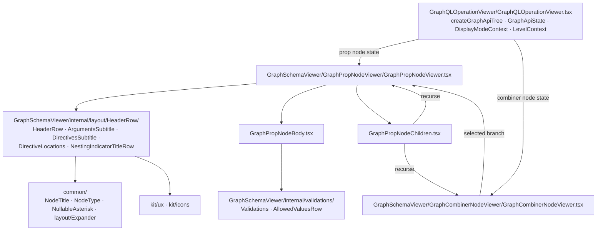

# GraphQL (legacy) — viewer, plain

Paths are relative to `packages/api-doc-viewer/src/components/`. **Legacy** — change only with
explicit approval.

```mermaid
flowchart TB
  Root["GraphQLOperationViewer/GraphQLOperationViewer.tsx<br/>createGraphApiTree · GraphApiState · DisplayModeContext · LevelContext"]
  Prop["GraphSchemaViewer/GraphPropNodeViewer/GraphPropNodeViewer.tsx"]
  Combiner["GraphSchemaViewer/GraphCombinerNodeViewer/GraphCombinerNodeViewer.tsx"]
  Body["GraphPropNodeBody.tsx"]
  Children["GraphPropNodeChildren.tsx"]
  Header["GraphSchemaViewer/internal/layout/HeaderRow/<br/>HeaderRow · ArgumentsSubtitle · DirectivesSubtitle ·<br/>DirectiveLocations · NestingIndicatorTitleRow"]
  Validations["GraphSchemaViewer/internal/validations/<br/>Validations · AllowedValuesRow"]
  Common["common/<br/>NodeTitle · NodeType · NullableAsterisk · layout/Expander"]
  Kit["kit/ux · kit/icons"]

  Root -->|prop node state| Prop
  Root -->|combiner node state| Combiner
  Prop --> Header
  Prop --> Body
  Prop --> Children
  Body --> Validations
  Children -->|recurse| Prop
  Children -->|recurse| Combiner
  Combiner -->|selected branch| Prop
  Header --> Common
  Header --> Kit
```
