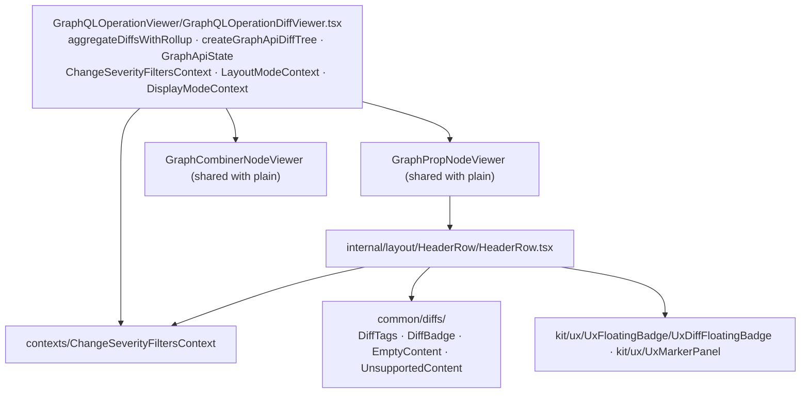

# GraphQL (legacy) — viewer, with diffs

Paths are relative to `packages/api-doc-viewer/src/components/`. **Legacy** — change only with
explicit approval. The same node components as [viewer-plain.md](viewer-plain.md) render diffs
through legacy change props.

`DiffTags` and `DiffBadge` are legacy-only; next viewers use `TagsWithDiffs` / `BadgeWithDiffs`.
