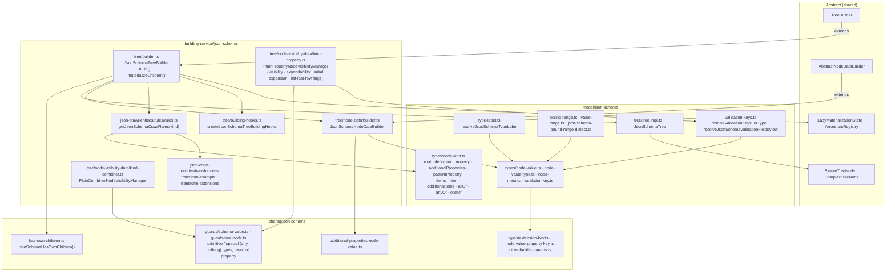

# JSON Schema — data model, plain

Paths are relative to `packages/next-data-model/src/`. Abstract layer:
[../../shared/architecture/data-model-plain.md](../../shared/architecture/data-model-plain.md).

