# JSON Schema — data model, with diffs

Paths are relative to `packages/next-data-model/src/`. Abstract layer:
[../../shared/architecture/data-model-with-diffs.md](../../shared/architecture/data-model-with-diffs.md).

```mermaid
flowchart TB
  subgraph ABS["Abstract (shared)"]
    AggAbs["Abstract*Aggregator (5 families)"]
    ChangedPropGuard["model/abstract/tree-with-diffs/changed-property-meta-data.ts<br/>isChangedPropertyMetaData"]
    UnchangedAbs["model/abstract/tree-with-diffs/changed-only/<br/>resolveUnchangedBlocks"]
    AggregatedAbs["aggregated-diff-types.ts<br/>takeAggregatedDiffs"]
  end

  subgraph PLAIN["Plain stack (data-model-plain.md)"]
    TreeBuilder["JsonSchemaTreeBuilder"]
    NodeDataBuilder["JsonSchemaNodeDataBuilder"]
    VisPlain["PlainPropertyNodeVisibilityManager"]
  end

  subgraph BSD["building-service/json-schema"]
    Transformer["shared/json-schema-spec-with-diffs-transformer.ts<br/>JsonSchemaSpecWithDiffsTransformer (aggregateDiffsWithRollup)"]
    BuilderD["tree-with-diffs/builder.ts<br/>JsonSchemaTreeWithDiffsBuilder"]
    NodeDataD["tree-with-diffs/node-data/builder.ts<br/>JsonSchemaNodeDataWithDiffsBuilder"]
    subgraph AGG["tree-with-diffs/node-diffs-data — Factory + Strategy"]
      DiffsFactory["node-diffs/factory.ts → KindProperty for every kind"]
      KindAny["node-diffs/kind-any.ts · KindAny<br/>whole-node cascade · meta flags · type label ·<br/>nesting-indicator and extensions rows · validation rows"]
      KindProperty["node-diffs/kind-property.ts · KindProperty<br/>default · enum · examples · required · list rows"]
      Severities["node-diffs-severities/{kind-any,kind-property}.ts<br/>one placement per row"]
      Summary["node-diffs-summary/kind-any.ts"]
      DescDiffs["node-descendant-diffs/kind-any.ts"]
      DescSummary["node-descendant-diffs-summary/kind-any.ts"]
    end
    VisD["tree-with-diffs/node-visibility-data/<br/>JsonSchemaNodeVisibilityManagerKindProperty · kind-property-expand.ts"]
    ChangedOnly["tree-with-diffs/changed-only/<br/>hasOwnChangeSignals · isJsonSchemaNodeChanged · resolveJsonSchemaUnchangedBlocks"]
  end

  subgraph MODELD["model/json-schema"]
    RowDiffs["tree-with-diffs/property-row-diffs.ts<br/>JsonSchemaRowDiffs (MetaFlags · RequiredStar · CustomAnnotations · …)"]
    RowDiffTypes["tree-with-diffs/property-row-diffs.types.ts"]
    TypeLabelDiffs["tree-with-diffs/type-label-diffs.ts<br/>JsonSchemaTypeLabelResolver"]
    CombinerRow["tree-with-diffs/combiner-row-diffs.ts<br/>JsonSchemaCombinerSelectorRowResolver"]
    ChipDisplay["tree-with-diffs/validation-row-chip-display.ts · validation-row-source-keys.ts"]
    ValueRange["value-range-diff-side-display.ts<br/>JsonSchemaValueRangeDiffResolver"]
    TreeD["tree-with-diffs/tree.impl.ts · JsonSchemaTreeWithDiffs"]
  end

  TreeBuilder -->|extends| BuilderD
  NodeDataBuilder -->|extends| NodeDataD
  BuilderD --> Transformer
  BuilderD --> NodeDataD
  BuilderD --> DiffsFactory
  BuilderD --> Severities
  BuilderD --> Summary
  BuilderD --> DescDiffs
  BuilderD --> DescSummary
  BuilderD --> TreeD
  DiffsFactory --> KindProperty
  KindProperty -->|extends, super.aggregate first| KindAny
  KindAny -->|extends| AggAbs
  KindAny --> AggregatedAbs
  KindAny --> ValueRange
  Summary --> ChangedPropGuard
  Severities --> RowDiffTypes
  VisD --> VisPlain
  VisD --> ChangedOnly
  ChangedOnly --> UnchangedAbs
  RowDiffs --> TypeLabelDiffs
  RowDiffs --> ChipDisplay
  RowDiffs --> ValueRange
  CombinerRow --> RowDiffs
  CombinerRow --> ChangedPropGuard
```

## Notes

- `JsonSchemaNodeDataWithDiffsBuilder` is an intentionally empty extension point.
- `JsonSchemaCombinerSelectorRowResolver` runs at read time over the built tree, because combiner
  branches do not exist yet when the owner's own diffs are aggregated during the crawl.
