# OpenAPI — data model, plain

Status: **planned**. Paths are relative to `packages/next-data-model/src/`. Abstract layer:
[../../shared/architecture/data-model-plain.md](../../shared/architecture/data-model-plain.md).

```mermaid
flowchart TB
  subgraph ABS["Abstract (shared)"]
    TreeBuilderAbs["TreeBuilder"]
    NodeDataBuilderAbs["AbstractNodeDataBuilder"]
    HooksAbs["createTreeBuildingHooks · CommonState"]
    NodesAbs["SimpleTreeNode · ComplexTreeNode"]
  end

  subgraph SHARED["shared/openapi"]
    Keys["types/operation-keys.ts · OpenApiOperationKeys"]
    Params["types/tree-builder-params.ts"]
    Codes["types/response-code.ts<br/>OpenApiResponseCodeClasses · OpenApiResponseCode.resolveClass / compare"]
    Methods["types/http-method.ts · OpenApiHttpMethod (from OPEN_API_HTTP_METHODS)"]
    Guards["guards/{tree-node,security,schema}.ts"]
  end

  subgraph MODEL["model/openapi"]
    Kinds["types/node-kind.ts<br/>operation · security · securityRequirement · securityScheme · oauthFlow ·<br/>extensions · request · parameters · requestBody · content · mediaType ·<br/>responses · response · responseHeaders"]
    Values["types/node-value.ts · node-meta.ts · aliases.ts"]
    TreeImpl["tree/{tree,simple-node,complex-node}.impl.ts · OpenApiTree"]
    Labels["display/ · OpenApiOperationTitle · OpenApiSecurityRequirementTitle ·<br/>OpenApiSecuritySchemeTypeLabel"]
  end

  subgraph BS["building-service/openapi"]
    Dialects["shared/dialects/<br/>OpenApiDialectResolver → OpenApi30Dialect | OpenApi31Dialect"]
    Transformer["shared/openapi-spec-transformer.ts<br/>OpenApiSpecTransformer<br/>resolveOperation · resolveEffectiveSecurity · resolveSecuritySchemes ·<br/>splitParameters · copyExtensions · orderResponses"]
    Synth["shared/object-schema-synthesizer.ts<br/>OpenApiObjectSchemaSynthesizer"]
    Builder["tree/builder.ts · OpenApiTreeBuilder"]
    Hooks["tree/building-hooks.ts · createOpenApiTreeBuildingHooks"]
    Rules["json-crawl-entities/rules/rules.ts · getOpenApiCrawlRules(kind)"]
    CrawlTx["json-crawl-entities/transformers/<br/>collect-raw-values"]
    NodeData["tree/node-data/builder.ts · OpenApiNodeDataBuilder"]
    Visibility["tree/node-visibility-data/kind-*.ts<br/>OpenApiNodeVisibilityManagerKind*"]
  end

  TreeBuilderAbs -->|extends| Builder
  NodeDataBuilderAbs -->|extends| NodeData
  Builder --> Params
  Params --> Keys
  Builder --> Transformer
  Transformer --> Dialects
  Transformer --> Synth
  Transformer --> Codes
  Transformer --> Methods
  Builder --> Hooks
  Hooks --> HooksAbs
  Builder --> Rules
  Rules --> CrawlTx
  Rules --> Kinds
  Builder --> NodeData
  NodeData --> Values
  Builder --> TreeImpl
  TreeImpl --> NodesAbs
  Visibility --> Values
  Labels --> Values
  Guards --> Kinds
```



## Operation-oriented spec

Output of `OpenApiSpecTransformer.transform(source, operationKeys)`; input of the crawl. Every
field below `data` maps to one node kind through the crawl rules.

```typescript
export interface OpenApiOperationOrientedSpec {
  id: string                                   // `${METHOD} ${path}`
  path: string
  method: OpenApiHttpMethod
  specVersion: OpenApiSpecVersion
  title?: string                               // summary
  operationId?: string
  description?: string
  externalDocs?: OpenApiExternalDocs
  deprecated?: boolean
  data: {
    security?: OpenApiSecuritySpec             // entities/security.md
    extensions?: Record<SpecificationExtensionKey, unknown>
    request?: {
      parameters?: Partial<Record<OpenApiParameterLocation, { location; schema: OpenApiSynthesizedObjectSchema }>>
      requestBody?: { description?: string; required?: boolean; content?: Record<string, { mediaType: string; schema?: unknown }> }
    }
    responses?: Record<string, {               // canonical order
      code: string
      codeClass: OpenApiResponseCodeClass
      description?: string
      headers?: { schema: OpenApiSynthesizedObjectSchema }
      content?: Record<string, { mediaType: string; schema?: unknown }>
    }>
  }
}
```

Empty containers are omitted (no `request` without parameters and body, no `headers` without
entries) so visibility can rely on presence.

## Crawl rules

`getOpenApiCrawlRules(kind)` — same shape as `getAsyncApiCrawlRules`:

```typescript
{
  '/data': {
    '/security': {
      '/alternatives': {
        '/*': {
          '/schemes': { '/*': { '/flows': { '/*': { kind: OAUTH_FLOW } }, kind: SECURITY_SCHEME } },
          kind: SECURITY_REQUIREMENT,
        },
      },
      kind: SECURITY, complex: true,
    },
    '/extensions': { kind: EXTENSIONS, transformers: [collectRawValues] },
    '/request': {
      '/parameters': { '/*': { kind: PARAMETERS } },
      '/requestBody': { '/content': { '/*': { kind: MEDIA_TYPE }, kind: CONTENT, complex: true }, kind: REQUEST_BODY },
      kind: REQUEST,
    },
    '/responses': {
      '/*': {
        '/headers': { kind: RESPONSE_HEADERS },
        '/content': { '/*': { kind: MEDIA_TYPE }, kind: CONTENT, complex: true },
        kind: RESPONSE,
      },
      kind: RESPONSES, complex: true,
    },
  },
  kind,
}
```

Notes:

- Intermediate segments without `kind` (`/data`, `/alternatives`, `/schemes`, `/flows`,
  `/parameters`) only route the crawl: `createTreeBuildingHooks`
  (`abstract/json-crawl-entities/hooks/builder.ts`) returns without creating a node when
  `rules.kind` is missing and keeps crawling.
- Leaf kinds (`parameters`, `responseHeaders`, `mediaType`, `extensions`, `oauthFlow`) declare no
  sub-rules: the same hook returns `{ done: true }` for a key without rules, so schemas and raw
  values stay on the node value and are rendered by nested viewers.
- `resolveNodeKey`: alternatives use their index, schemes their name, media types and codes their
  key — no `referenceNamePropertyKey` lookup (OpenAPI needs none).
- Lazy materialization: not used (eager build, like AsyncAPI); the tree is small — nested schemas
  are not crawled by this builder.

## Notes

- Node value pick lists live in `OpenApiNodeDataBuilder.getOpenApiTreeNodeValueProps(kind)`
  (typed overloads, `satisfies` per kind), as in AsyncAPI.
- `meta`: `{ _fragment, brokenRef?, unresolvedSecurityScheme? }`.
- Visibility managers exist per kind that has optional rows: `operation`, `security`,
  `securityScheme`, `oauthFlow`, `request`, `requestBody`, `responses`, `response`
  (see `next-data-model-authoring` → node-visibility).
- Export `OpenApiTreeBuilder`, `OpenApiTreeWithDiffsBuilder`, `createOpenApiLogger` from the package
  root `src/index.ts`, next to the AsyncAPI exports.
