# OpenAPI — data model, with diffs

Status: **implemented** (first iteration; deviations in [../notes/2026-10-implementation-decisions.md](../notes/2026-10-implementation-decisions.md)). Paths are relative to `packages/next-data-model/src/`. Abstract layer:
[../../shared/architecture/data-model-with-diffs.md](../../shared/architecture/data-model-with-diffs.md).
Rules: [../features/diffs.md](../features/diffs.md).

```mermaid
flowchart TB
  subgraph ABS["Abstract (shared)"]
    AggAbs["Abstract*Aggregator (5 families)"]
    Aggregated["aggregateDiffsWithRollup · aggregatedDiffsMetaKey<br/>mergeAggregatedDiffTypesIntoDescendantSummary"]
    ListSide["list-side-display.ts · resolveListSideItems"]
    NodesDAbs["SimpleTreeNodeWithDiffs · ComplexTreeNodeWithDiffs"]
    Placements["NodeDiffsSeverityPlacemennt<br/>+ ExternalDocsRow · SelectorRow · SecurityScheme*Row ·<br/>SecurityRequiredScopesRow · OAuthFlow*Row"]
  end

  subgraph PLAIN["Plain stack (data-model-plain.md)"]
    Builder["OpenApiTreeBuilder"]
    NodeData["OpenApiNodeDataBuilder"]
    Transformer["OpenApiSpecTransformer"]
    Synth["OpenApiObjectSchemaSynthesizer"]
    VisPlain["tree/node-visibility-data/kind-*"]
  end

  subgraph BSD["building-service/openapi"]
    TransformerD["shared/openapi-spec-with-diffs-transformer.ts<br/>OpenApiSpecWithDiffsTransformer<br/>relocate diff records · effective security diffs · rollup"]
    SynthD["shared/object-schema-with-diffs-synthesizer.ts<br/>OpenApiObjectSchemaWithDiffsSynthesizer"]
    Presence["shared/section-presence-resolver.ts<br/>OpenApiSectionPresenceResolver<br/>presence per side → synthetic section add / remove"]
    BuilderD["tree-with-diffs/builder.ts<br/>OpenApiTreeWithDiffsBuilder · assignNodeDiffs"]
    NodeDataD["tree-with-diffs/node-data/builder.ts<br/>OpenApiNodeDataWithDiffsBuilder"]
    VisD["tree-with-diffs/node-visibility-data/kind-*"]
    subgraph AGG["tree-with-diffs/node-diffs-data — Factory + Strategy"]
      Diffs["node-diffs/<br/>KindAny · KindOperation · KindSecurity · KindSecurityScheme · KindOAuthFlow ·<br/>KindExtensions · KindRequest · KindParameters · KindResponses · KindResponse · KindResponseHeaders"]
      DescDiffs["node-descendant-diffs/<br/>KindAny · KindSecurity · KindRequest · KindContent · KindResponses"]
      DescSummary["node-descendant-diffs-summary/<br/>KindAny · forward: parameters · responseHeaders · mediaType · extensions ·<br/>content · requestBody · request · response · responses"]
      Summary["node-diffs-summary/KindAny"]
      Severities["node-diffs-severities/<br/>KindAny · KindSecurityScheme · KindOAuthFlow"]
    end
  end

  subgraph MODELD["model/openapi/tree-with-diffs"]
    TreeD["tree.impl.ts · OpenApiTreeWithDiffs"]
    RowDiffs["row-diffs.ts · OpenApiRowDiffs"]
  end

  Builder -->|extends| BuilderD
  NodeData -->|extends| NodeDataD
  Transformer -->|extends| TransformerD
  Synth -->|extends| SynthD
  VisPlain -.->|delegates diff-free rules| VisD
  BuilderD --> TransformerD
  TransformerD --> SynthD
  TransformerD --> Presence
  TransformerD --> Aggregated
  BuilderD --> NodeDataD
  BuilderD --> Diffs
  BuilderD --> DescDiffs
  BuilderD --> DescSummary
  BuilderD --> Summary
  BuilderD --> Severities
  Diffs -->|extend| AggAbs
  DescSummary --> Aggregated
  Severities --> Placements
  BuilderD --> TreeD
  TreeD --> NodesDAbs
  RowDiffs --> ListSide
  RowDiffs --> NodesDAbs
```

## Builder contract

`OpenApiTreeWithDiffsBuilder` follows `AsyncApiTreeWithDiffsBuilder` line by line:

| Member | Rule |
| --- | --- |
| `public declare readonly tree: OpenApiTreeWithDiffs` | retype only |
| `createTree()`, `createNodeDataBuilder()`, `prepareSource()`, `logPrefix` (`[OpenAPI][WithDiffs]`) | overrides |
| `takeCrawlValue()` | keeps arrays (`isObjective`) — list-like kinds read diff records from arrays |
| `createNodeFromRaw()` | `super.createNodeFromRaw(...)`, narrow with `isOpenApiTreeNodeWithDiffs` (`shared/openapi/guards/tree-node.ts`), then `assignNodeDiffs` |
| `assignNodeDiffs()` | node diffs → summary → descendant diffs → `aggregateByDescendantDiffs` → descendant summary + `mergeAggregatedDiffTypesIntoDescendantSummary` → severities (same order as AsyncAPI) |

No type assertions between plain and with-diffs node types; guards only.

## Notes

- The transformer relocates diff records; aggregators read **only** the transformed spec, never
  the merged document — the same split as AsyncAPI.
- Parameters, response headers, media-type schemas, and extensions are separate trees in the
  viewer; forward descendant-summary aggregators read `aggregatedDiffsMetaKey` so changes inside
  those trees still mark selector options and section headers.
- Section headers follow
  [../../shared/features/section-header-colorizing.md](../../shared/features/section-header-colorizing.md)
  evaluated over section presence per side, [../features/diffs.md](../features/diffs.md#section-presence-and-whole-section-changes).
