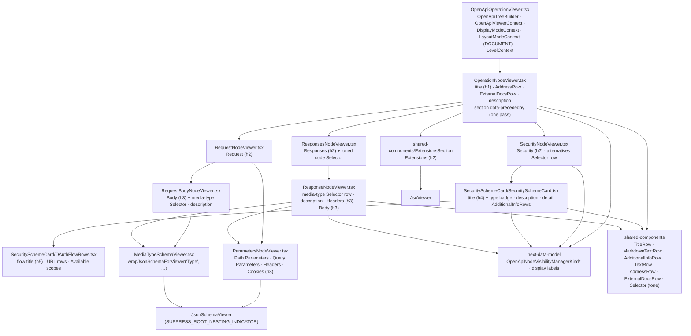

# OpenAPI — viewer, plain

Status: **planned**. Paths are relative to
`packages/api-doc-viewer/src/components/OpenApiOperationViewer/`. Abstract layer:
[../../shared/architecture/viewer-plain.md](../../shared/architecture/viewer-plain.md). Row stack:
[../features/operation-viewer.md](../features/operation-viewer.md#row-stack).

## Notes

- Containers read node values, visibility flags, and display labels from next-data-model; they
  compute neither visibility nor labels.
- Child lists go through guard helpers (`utils/openapi/node-type-checkers.ts`), never
  `childrenNodes() as …`.
- All hooks run before any early `return` (outer component returns `null` for a missing source,
  inner component checks the root kind after its hooks).
