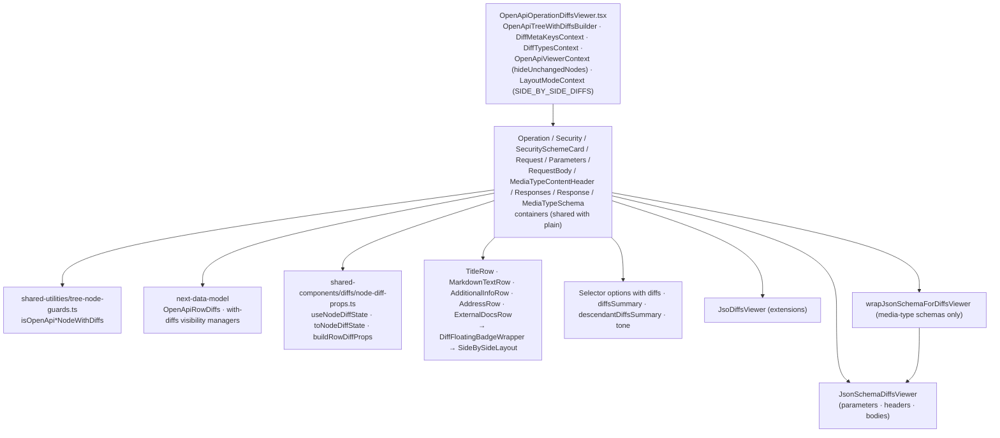

# OpenAPI — viewer, with diffs

Status: **implemented** (first iteration; deviations in [../notes/2026-10-implementation-decisions.md](../notes/2026-10-implementation-decisions.md)). Paths are relative to
`packages/api-doc-viewer/src/components/OpenApiOperationViewer/`. Abstract layer:
[../../shared/architecture/viewer-with-diffs.md](../../shared/architecture/viewer-with-diffs.md).
Rules: [../features/diffs.md](../features/diffs.md).

Like AsyncAPI, the OpenAPI layer has **no separate with-diffs containers** (D5): the plain
containers ([viewer-plain.md](viewer-plain.md)) detect with-diffs nodes and add diff props read
from `OpenApiRowDiffs`. Only the root, providers, nested viewers, and visibility managers differ.

## Notes

- Parameter groups and response headers go to `JsonSchemaDiffsViewer` **unwrapped**: the
  synthesizer already attached property-level diffs (no AsyncAPI-style stamping in the viewer).
- Every row passes its own `diffsSeverityPlacement`; no two rows of one node share a placement.
- Rows whose content div plugs into `SideBySideLayout` carry `flex w-full` (width contract). Verify
  row-background width with `getBoundingClientRect()` in the IT or Storybook — pale diff
  backgrounds are invisible to pixelmatch (testing skill, pixel-diff blind spot).
- `JsoDiffsViewer` installs its own contexts; OpenAPI-level `diffTypes` do not reach extensions
  (same as AsyncAPI).
