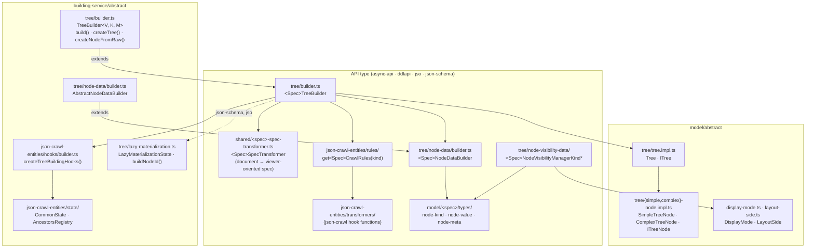

# Data model — plain (abstract)

The API-type-agnostic layer of `next-data-model` that every plain tree builder extends. API-type
diagrams attach their classes to the nodes in the **Abstract** subgraph.

## Notes

- Node dispatch is driven by two brand fields: `type` (simple / complex) and `kind` (API-type
  specific). Kind-specific logic is a Strategy selected by kind.
- Row visibility for plain rendering belongs in `node-visibility-data/` managers; AsyncAPI still
  keeps it in the viewer (`shouldBeDisplayed`).
- Lazy materialization: [../features/lazy-materialization.md](../features/lazy-materialization.md).
