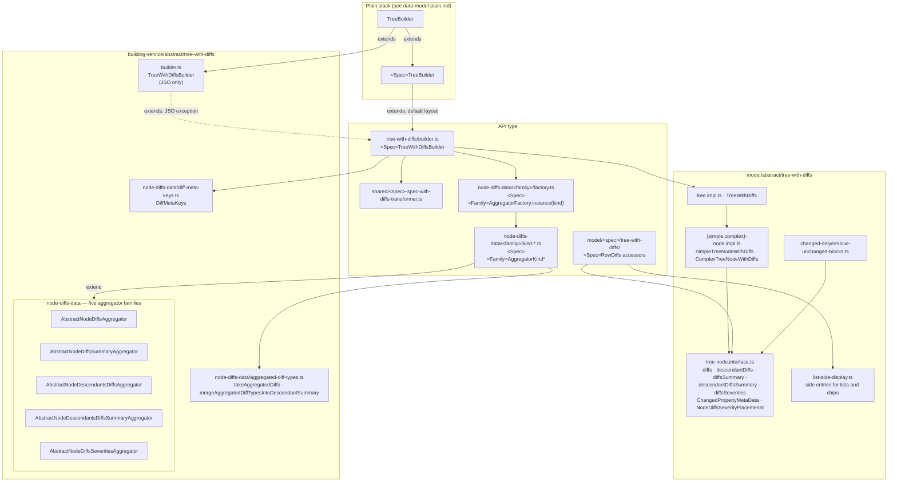

# Data model — with diffs (abstract)

The API-type-agnostic diff layer of `next-data-model`. With-diffs builders read a merged `apiDiff`
document (diffs attached under `DiffMetaKeys`) and attach precomputed diff state to every node.

## Node diff fields

| Field | Meaning |
| --- | --- |
| `diffs[key]` | Diff of one value field; `diffs[""]` (`NODE_LEVEL_DIFF_KEY`) is the whole-node diff |
| `descendantDiffs[childKey]` | Diffs of direct children, keyed by child key |
| `diffsSummary` | Diff types of the node itself |
| `descendantDiffsSummary` | Diff types anywhere below the node |
| `diffsSeverities[placement]` | One severity per rendered row (`title-row`, `description-row`, …) |

Each diff is a `ChangedPropertyMetaData`: the `Diff` plus per-side `styles` (visibility, colors),
`flags` (level increase), and `highlightingMode` — everything a viewer needs to render it.

## Notes

- Default layout: `<Spec>TreeWithDiffsBuilder` extends `<Spec>TreeBuilder` and adds only diff
  methods and factory overrides. JSO is the exception and extends `TreeWithDiffsBuilder`.
- Each family is a Factory + Strategy: the factory returns a kind-specific aggregator; kind
  aggregators extend `KindAny` and call `super.aggregate()` first.
- Section headers follow [../features/section-header-colorizing.md](../features/section-header-colorizing.md).
