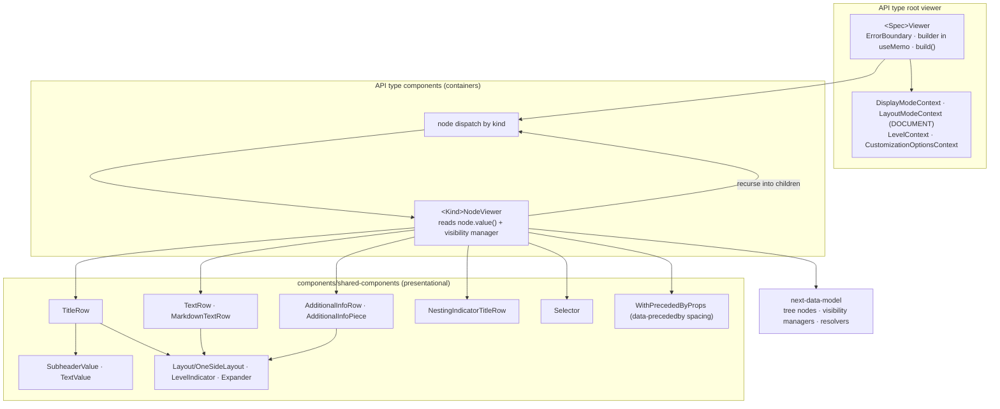

# Viewer — plain (abstract)

The API-type-agnostic shape of a plain viewer in `api-doc-viewer`. API-type diagrams replace the
**API type** subgraph with their concrete components.

## Notes

- **Container / presentational split.** Containers are API-type specific and read tree nodes;
  shared components only draw resolved values and must not grow API-type branches.
- Expansion and selection are local React state; `api-state-model` is used only by legacy GraphQL.
- Rows set `data-precededby` so spacing and the level indicator line stay continuous.
