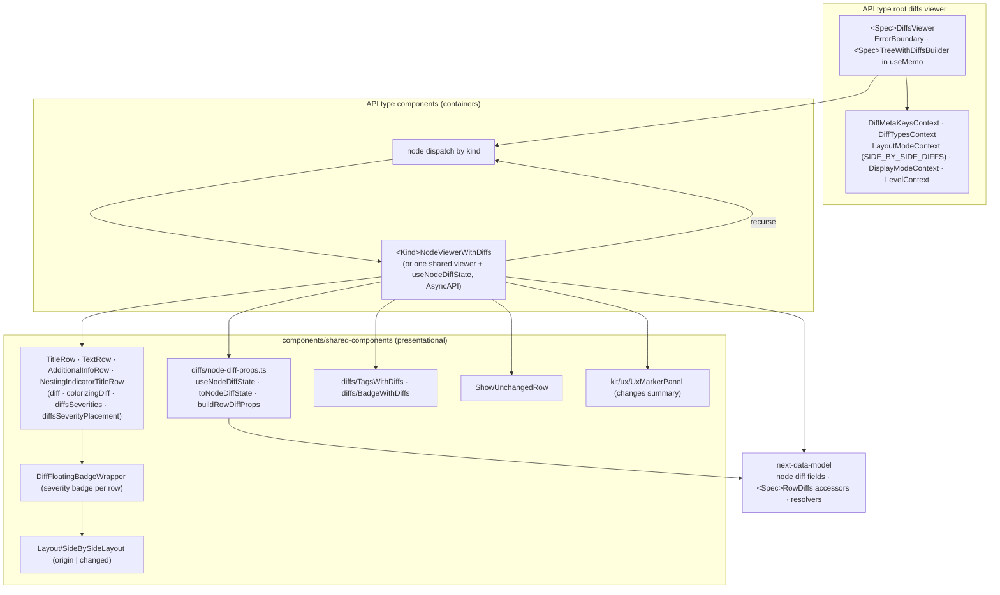

# Viewer — with diffs (abstract)

The API-type-agnostic shape of a with-diffs viewer. Diffs viewers consume precomputed node diff
fields; they never compute diffs.

## Notes

- Every row renders twice (origin and changed side) inside one `SideBySideLayout`; hiding always
  applies to the whole row.
- Each row reads its own severity placement; sibling rows never share one.
- `DiffTags` / `DiffBadge` under `components/common/diffs/` are legacy GraphQL-only; next viewers use
  `TagsWithDiffs` / `BadgeWithDiffs`.
