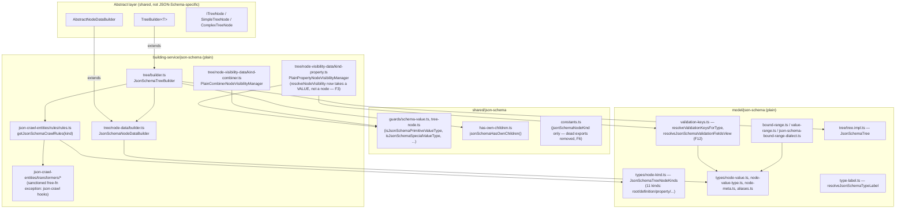
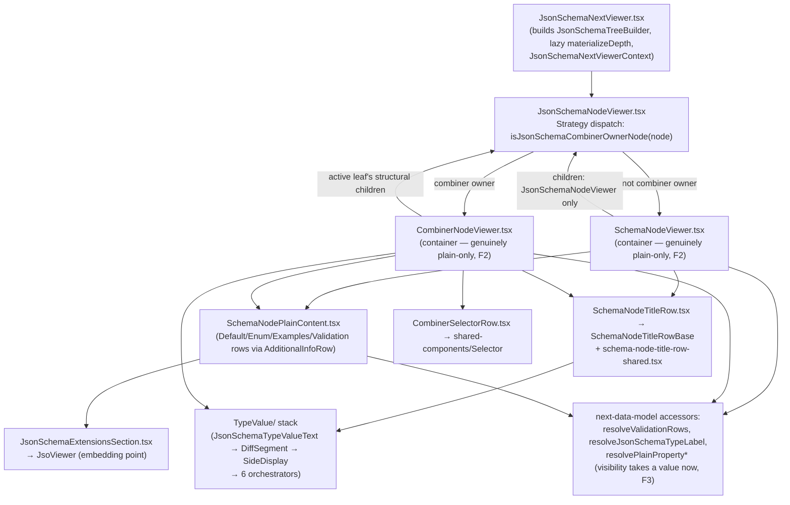
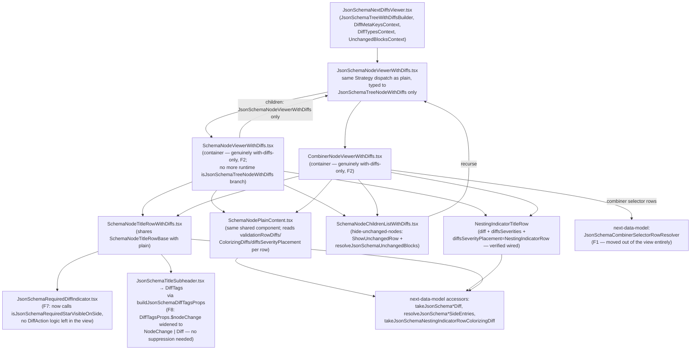

# JSON Schema Next Stack — Architecture Review

Review of `JsonSchemaNextViewer` / `JsonSchemaNextDiffsViewer` (`packages/api-doc-viewer/src/components/JsonSchemaNextViewer/`)
and everything supporting them in `packages/next-data-model/src/{model,building-service,shared}/json-schema/`, against
the constraints in `review-json-schema.md`. Scope excludes `stories/`, `it/`, and `samples/` per the review brief.

**Status: iteration 1 of fixes applied and verified** (see §8). Every fix below was applied one at a time; after each
one, both packages were type-checked (`tsc --noEmit`, invoked directly — not via `npm run`, per the review's
constraint) and their full Jest suites were run directly (`node_modules/.bin/jest`), so no fix broke an earlier one.
Current state: **0 TypeScript errors, 33 next-data-model suites / 548 tests passing, 10 api-doc-viewer suites / 81
tests passing.**

---

## 1. Executive summary

The JSON Schema Next stack was, before this iteration, the best-executed API type in this codebase against the
review's own rules — but it had two systemic problems: real diff-aggregation logic living in the view layer, and a
merged plain/with-diffs component pair standing in for what should have been a real split. Both are now fixed:

1. **Diff-aggregation logic relocated to next-data-model.** The combiner-selector-row diff/severity logic that used
   to live in `JsonSchemaNextViewer/utils/resolve-combiner-node-diffs.ts` (view package) now lives in a new
   `JsonSchemaCombinerSelectorRowResolver` class in `next-data-model/src/model/json-schema/tree-with-diffs/
   combiner-row-diffs.ts`. The viewer file that remains only builds presentational `SelectorOption` objects — no
   diff computation.
2. **`SchemaNodeViewer`/`CombinerNodeViewer` are now genuinely split** into real `<X>` (plain) and `<X>WithDiffs`
   components, matching the DDL/JSO/AsyncAPI convention. The `*WithDiffs` files are no longer no-op passthroughs.
   This also eliminated three unjustified type casts as a direct structural consequence.

Everything else from the original findings list is resolved, rejected, or explicitly deferred per your review
decisions — see the status column in §2. A follow-up full audit of the six next-data-model aggregator files that
were only spot-checked in the first pass (F21) found one additional instance of the same cross-package import smell
as F15; it has been fixed the same way.

No CSS/BEM problems were found in either pass. No npm-script, TypeScript/Vite/ESLint config, sample, story, or
screenshot-test changes were made or are recommended.

---

## 2. Findings and their resolution

Status icons: ✅ Fixed & verified · ⏳ Approved, not yet applied · 🚫 Rejected (per your decision, left as-is) ·
➖ No action needed (per your decision) · 📝 Doc updated (source fixed; compiled copies pending `apm install` —
see §7).

| ID | Status | Severity | Where | What | Resolution |
|----|--------|----------|-------|------|------------|
| **F1** | ✅ | High | `JsonSchemaNextViewer/utils/resolve-combiner-node-diffs.ts` (was: whole file) | Diff-aggregation logic (synthetic diffs, severity roll-up, uniform-variant detection) lived in the view layer. | Moved to new `next-data-model/src/model/json-schema/tree-with-diffs/combiner-row-diffs.ts` (`JsonSchemaCombinerSelectorRowResolver` class, public API: `resolveCombinerSelectorRowPresentation`, `resolveCombinerSelectorLevelReductionAction`). Viewer file now only keeps `resolveCombinerOptionTitleSuffix`/`buildCombinerSelectorOption` (presentational). Regression tests moved/expanded into `next-data-model/tests/unit-tests/json-schema-combiner-row-diffs.test.ts`; a viewer-only test for `buildCombinerSelectorOption` stays in `packages/api-doc-viewer/tests/resolve-combiner-node-diffs.test.ts`. |
| **F2** | ✅ | High (architectural) | `SchemaNodeViewer`/`SchemaNodeViewerWithDiffs`, `CombinerNodeViewer`/`CombinerNodeViewerWithDiffs` | `*WithDiffs` were no-op passthroughs; all logic lived in one runtime-branching component. | Option (a) implemented: four genuinely separate components now exist, each typed to only its own node kind (`JsonSchemaTreeNode` vs `JsonSchemaTreeNodeWithDiffs`), sharing only `SchemaNodeTitleRowBase`/`schema-node-title-row-shared.tsx`/`SchemaNodePlainContent`/the `TypeValue` stack, matching the DDL/JSO/AsyncAPI convention. |
| **F3** | ✅ | High | `SchemaNodePlainContent.tsx`, `CombinerNodeViewer.tsx` (fake-node casts) | Both fabricated a duck-typed fake node to satisfy `resolvePlainPropertyNodeVisibility`'s node-shaped parameter. | `resolvePlainPropertyNodeVisibility` (and its class method) now take the **value** directly (`JsonSchemaTreeNodeStoredValue \| null`), not a node. Both call sites now pass the value they already had; no fake node needed anywhere. |
| **F4** | ✅ | High | `SchemaNodeViewer.tsx:69` | `resolvePlainPropertyNodeVisibility(node as JsonSchemaTreeNode<PROPERTY>, ...)` cast. | Resolved as a side effect of F3 (pass `node.value()`, no cast) and F2 (the plain-only file no longer needs the kind-narrowing branch at all). |
| **F5** | ✅ | High | `CombinerNodeViewer.tsx:348` (`as never`) | Fully type-unsafe cast to dynamically select `JsonSchemaNodeViewer` vs `WithDiffs`. | Resolved by F2 (each split file only ever renders its own child-viewer variant, no runtime selection needed) — plus a real gap fix: `resolveCombinerLeafStructuralChildren` and `buildCombinerSelectorOption` are now properly generic (`<N extends JsonSchemaTreeNode>`), matching the pattern already used by their sibling `resolveActiveLeafNode`/`resolveCombinerSelectorLevels`, so children/options keep their concrete with-diffs type without a cast at the call site. |
| **F6** | ✅ | High | `shared/json-schema/constants.ts` | ~80 lines of dead/duplicate node-kind and value-props tables. | File reduced to the one still-used export (`jsonSchemaNodeKind`); the six dead exports and their now-unused api-unifier/type imports were deleted. `jsonSchemaNodeKind` itself is kept (still consumed by `rules.ts` in next-data-model and by `api-doc-viewer/src/utils/nodes.ts`, outside review scope) rather than replaced at every call site, per your explicit scope instruction. |
| **F7** | ✅ | Medium | `JsonSchemaRequiredDiffIndicator.tsx` | Re-derived diff-side-visibility semantics from raw `DiffAction` in the view. | New next-data-model accessor `isJsonSchemaRequiredStarVisibleOnSide` (`property-row-diffs.ts`) encapsulates the side-visibility decision; the component now only calls it and renders. |
| **F8** | ✅ | Medium | `utils/json-schema-diff-tags-props.ts:46` | Live `@ts-expect-error` bridging a type mismatch between next-data-model's `Diff` and the legacy `DiffTags` component's `NodeChange`-typed prop. | Root cause was in the **reused** component, not the caller: `DiffTagsProps.$nodeChange` is now typed `NodeChange \| Diff` (the component already internally cast to `Diff` at its two use sites — the type was simply dishonest about what it accepted). Legacy consumers (`GraphSchemaViewer`, legacy `JsonSchemaViewer`) are unaffected — widening a type is backward compatible. Suppression removed; compiles clean without it. |
| **F9** | ✅ | Medium | `value-range-diff-side-display.ts` | ~20 free functions implementing value-range diff-classification domain logic. | You explicitly prioritized OOP encapsulation over the testability trade-off I'd originally proposed. Rewrote the whole module as one `JsonSchemaValueRangeDiffResolver` static class (public methods = the old public API, private methods = the old internal helpers); the two call sites (`kind-any.ts`, `property-row-diffs.ts`) now call `JsonSchemaValueRangeDiffResolver.<method>(...)`. No behavior change — verified via the full next-data-model suite (536→still 536 passing at that point). |
| **F10** | ✅ | Medium | `property-row-diffs.ts` (four near-identical list-side-resolution functions) | `resolveJsonSchemaWholeListSideEntries`/`resolveJsonSchemaPartialListSideEntries`/`resolveJsonSchemaValidationRowPartialSideEntries`/`resolveJsonSchemaListValueSideItems` repeated the same per-index diff-branching algorithm. | Extracted one shared `resolveListDiffSideEntriesCore` (parametrized by a diff-key resolver, a value formatter, and a sort-index resolver); the three per-item-diff functions (`WholeListSideEntries` is a genuinely different whole-row algorithm and was intentionally left separate) now project its output to their own return shape. |
| **F11** | ⏳ | Medium | `SchemaNodePlainContent.tsx` (four near-identical `useCallback`s) | `allowedAdditionalPropertyNamesSubheader`/`enumValuesAdditionalInfoSubheader`/`examplesAdditionalInfoSubheader`/`defaultAdditionalInfoSubheader` repeated the same shape. | **Not yet applied.** Approved but not reached in this iteration; still open for a follow-up pass (see §9). |
| **F12** | ✅ | Medium | `utils/validation-rows.ts:64-67`, `model/json-schema/validation-keys.ts` | Eight ad hoc per-shape casts to read validation fields off a merged node value. | New next-data-model helper `resolveJsonSchemaValidationFieldsView` (`validation-keys.ts`) safely reads all validation-relevant fields via `isObject` + `typeof` narrowing (no casts) into one merged view type; both the viewer's `resolveValidationRows` and the data layer's `resolveValidationKeysForType` now use it. `resolveValueRangeLabel`'s parameter type was narrowed to a `Pick<...>` so it accepts the merged view directly. |
| **F13** | ✅ | Medium | `SchemaNodePlainContent.tsx:352-357` | Inline object type + unjustified cast for value-range crawl value. | Root-caused further than originally proposed: `resolveJsonSchemaValidationRowSideEntries`'s `valueRangeContext.nodeValue` parameter was itself over-narrowly typed — the function it delegates to (`resolveValueRangeSideInputFromNodeValue`) already safely accepts `unknown`. Widened the parameter to `unknown`; the viewer now passes `value` directly, no cast and no inline type anywhere. |
| **F14** | 📝 | Medium | `api-doc-viewer-authoring` skill doc | Stale claim that `AdditionalInfoRow`/`Selector` are still DDL-local. | Fixed the one stale file-path reference in the **canonical** source (`agent-packages/api-doc-viewer-authoring/.apm/skills/api-doc-viewer-authoring/SKILL.md`) to point at `shared-components/AdditionalInfoRow/`. The compiled copies (`.claude/skills/...`, `.cursor/skills/...`, `apm_modules/_local/...`) are now stale relative to the canonical source until you run `apm install` — I did not hand-edit generated files. |
| **F15** | ✅ | Low | `resolve-combiner-node-diffs.ts:6` (ddlapi guard import from the viewer) | JSON Schema viewer depended on a ddlapi-specific type guard. | Resolved structurally by F1 (the importing file is gone). Root cause also fixed at the source: `isChangedPropertyMetaData` was relocated to a new spec-agnostic `next-data-model/src/model/abstract/tree-with-diffs/changed-property-meta-data.ts`; the ddlapi guards file now re-exports it (zero call-site churn for its existing consumers) and the new `combiner-row-diffs.ts` imports it directly from the spec-agnostic location. |
| **F16** | 🚫 | Low | `JsonSchemaNextViewer.tsx`, `JsonSchemaNextDiffsViewer.tsx` (`console.debug`) | Left-in debug logging. | Rejected by you — left as-is, no change made. |
| **F17** | ✅ | Low | `SchemaNodeViewerWithDiffs.tsx:3` | Dead commented-out import. | Resolved by F2 — the file was rewritten from scratch as a real component; the dead comment no longer exists. |
| **F18** | ✅ | Low | `JsonSchemaNodeTitle.tsx:55-56` | Deprecated `JsonSchemaNodeTitle` alias, verified zero non-definition usages. | Deleted. |
| **F19** | ✅ | Low | `CombinerNodeViewer.tsx:170-176` | Two overlapping `useEffect`s for expand-state re-derivation. | Consolidated into one effect that explicitly branches on "did `activeLeaf.id` change" (reset to fresh initial state) vs. "same leaf, `treeRevision` bumped" (re-clamp current state) via a `useRef`-tracked previous leaf id — preserves the two genuinely different semantics the original two effects had (confirmed by tracing what each did before merging; a naive merge would have discarded the user's manual expand/collapse choice on every leaf change). |
| **F20** | ➖ | Low | `node-data/builder.ts` (empty with-diffs subclass) | Pure pass-through subclass. | No changes needed, per your decision — kept as an explicit extension point. |
| **F21** | ✅ | — | 6 not-fully-audited aggregator files (`node-diffs-severities`, `node-diffs-summary`, `node-descendant-diffs`, `node-descendant-diffs-summary` × `{kind-any, factory}`) | Full line audit requested since these implement different features than what was already audited. | All six read in full. Five of six are clean: correct Factory dispatch, correct single-responsibility class bodies, no free-function domain logic, no unjustified casts beyond the one already-accepted `nodeDiffs as JsonSchema*NodeDiffs` widening pattern used consistently across every JSON Schema aggregator (unavoidable given the abstract base's generic signature). **One finding**: `node-diffs-summary/kind-any.ts` imported `isChangedPropertyMetaData` from the same ddlapi-specific guard path as F15 — fixed the same way (now imports from the new spec-agnostic location). |

---

## 3. Architecture diagrams (updated to reflect the fixed structure)

### 3.1 `next-data-model` — plain stack

*(unchanged from the previous iteration — no plain-stack findings)*



### 3.2 `next-data-model` — with-diffs stack (extends 3.1)

```mermaid
flowchart TB
  subgraph PLAIN["Plain stack (3.1) — reused as-is"]
    TreeBuilder["tree/builder.ts\nJsonSchemaTreeBuilder"]
    NodeDataBuilder["tree/node-data/builder.ts\nJsonSchemaNodeDataBuilder"]
    VisProperty["node-visibility-data/kind-property.ts (plain)"]
    VisCombiner["node-visibility-data/kind-combiner.ts (plain)"]
  end

  subgraph ABSGUARD["model/abstract/tree-with-diffs"]
    ChangedPropGuard["changed-property-meta-data.ts\nisChangedPropertyMetaData()\n(spec-agnostic — relocated here from a\nddlapi-only guard file, F15/F21)"]
  end

  subgraph MODELD["model/json-schema/tree-with-diffs"]
    RowDiffTypes["property-row-diffs.types.ts\nJsonSchemaKindAnyNodeDiffs / KindPropertyNodeDiffs"]
    RowDiffs["property-row-diffs.ts (~800 LOC)\ntake*/resolve* accessor API (sanctioned free-fn layer)\n+ isJsonSchemaRequiredStarVisibleOnSide (F7)\n+ resolveListDiffSideEntriesCore (F10)"]
    TypeLabelDiffs["type-label-diffs.ts"]
    ValueRangeResolver["value-range-diff-side-display.ts\nJsonSchemaValueRangeDiffResolver (static class, F9)"]
    CombinerRowDiffs["combiner-row-diffs.ts (NEW, F1)\nJsonSchemaCombinerSelectorRowResolver (static class)\n- resolveCombinerSelectorRowPresentation\n- resolveCombinerSelectorLevelReductionAction\nRead-time resolver over the fully-built tree — see file\ndoc-comment for why this can't be a builder-time field\n(nestedNodes() don't exist yet when a combiner owner's\nown diffs are assigned during crawl)"]
    ValidationRowDisplay["validation-row-chip-display.ts, validation-row-source-keys.ts"]
    TreeImplD["tree-with-diffs/tree.impl.ts"]
  end

  subgraph BSD["building-service/json-schema/tree-with-diffs"]
    BuilderD["builder.ts\nJsonSchemaTreeWithDiffsBuilder extends JsonSchemaTreeBuilder"]
    Transformer["shared/json-schema-spec-with-diffs-transformer.ts\nJsonSchemaSpecWithDiffsTransformer"]
    NodeDataBuilderD["node-data/builder.ts\nJsonSchemaNodeDataWithDiffsBuilder extends JsonSchemaNodeDataBuilder\n(no-op subclass — kept as extension point, F20)"]

    subgraph AGG["node-diffs-data/ — 5 aggregator families, each Factory + Strategy (audited in full, F21)"]
      DiffsFactory["node-diffs/factory.ts\nJsonSchemaNodeDiffsAggregatorFactory.instance(kind)\n→ always KindProperty (documented superset)"]
      KindAny["node-diffs/kind-any.ts\nJsonSchemaNodeDiffsAggregatorKindAny\n(whole-node cascade, meta-flags, type-label,\nnesting-indicator colorizing, validation rows)"]
      KindProperty["node-diffs/kind-property.ts\nKindProperty extends KindAny\n(default/enum/examples/required)"]
      Severities["node-diffs-severities/{kind-any,kind-property,factory}.ts\n(per-row NodeDiffsSeverityPlacemennt — verified correct)"]
      DescDiffs["node-descendant-diffs/{kind-any,factory}.ts\n(clean — no findings)"]
      DiffsSummary["node-diffs-summary/{kind-any,factory}.ts\n(guard import fixed, F21)"]
      DescSummary["node-descendant-diffs-summary/{kind-any,factory}.ts\n(clean — no findings)"]
    end

    subgraph VISD["node-visibility-data (with-diffs)"]
      VisPropertyD["kind-property.ts\nJsonSchemaNodeVisibilityManagerKindProperty\n(diff-aware OR plain delegate)"]
      VisExpandD["kind-property-expand.ts\nresolveJsonSchemaPropertyInitiallyExpandedWithDiffs"]
    end

    subgraph CHANGEDONLY["changed-only/ (hiding unchanged nodes)"]
      HasSignals["has-own-change-signals.ts"]
      IsChanged["is-node-changed.ts\nisJsonSchemaNodeChanged (cycle-safe recursion)"]
      Unchanged["resolve-json-schema-unchanged-blocks.ts"]
    end
  end

  TreeBuilder -->|extends| BuilderD
  BuilderD --> Transformer
  BuilderD --> NodeDataBuilderD
  NodeDataBuilder -->|extends| NodeDataBuilderD
  BuilderD --> DiffsFactory
  BuilderD --> Severities
  BuilderD --> DescDiffs
  BuilderD --> DiffsSummary
  BuilderD --> DescSummary
  DiffsFactory --> KindProperty
  KindProperty -->|extends, calls super.aggregate first| KindAny
  KindAny --> ValueRangeResolver
  KindAny --> RowDiffs
  DiffsSummary --> ChangedPropGuard
  Severities --> RowDiffTypes
  VisPropertyD --> VisProperty
  VisExpandD --> IsChanged
  IsChanged --> HasSignals
  Unchanged --> IsChanged
  RowDiffs --> TypeLabelDiffs
  RowDiffs --> ValidationRowDisplay
  CombinerRowDiffs --> RowDiffs
  CombinerRowDiffs --> ChangedPropGuard
```



### 3.3 `api-doc-viewer` — `JsonSchemaNextViewer` (plain path)



### 3.4 `api-doc-viewer` — `JsonSchemaNextDiffsViewer` (with-diffs path — now a real split, F2)



---

## 4. Pattern-compliance notes (review §25-77) — updated

- **Strategy / Abstract Factory (kind dispatch).** Unchanged assessment, now further confirmed by the full F21
  audit: all five diff-aggregator families use correct Factory + Strategy dispatch with no exceptions found.
- **Container/Presentational.** F2 fixed the one real violation (`SchemaNodeViewer`/`CombinerNodeViewer`). Every
  other component in the tree was already correctly classified.
- **Type safety (Strict Always).** The one live `@ts-expect-error` is gone (F8). Of the original six unjustified
  `as` casts, all are now resolved: three by narrowing function signatures (F3, F12, F13) to not need a cast at
  all, three by genericizing sibling utility functions the same way their neighbors already were (F5). The two
  remaining `as N[]`/`as N[]` casts inside `resolveCombinerLeafStructuralChildren` are the same class of
  justified, narrowly-scoped exception already used by `resolveActiveLeafNode` in the same file — bridging a real
  `ITreeNode` interface limitation ("returns `this`'s own type"), not a workaround for insufficient type modeling.
- **OOP encapsulation of diff-aggregation logic.** Per your explicit priority (F9), every free-function module that
  computed diffs now lives as static methods on a single class per module (`JsonSchemaValueRangeDiffResolver`,
  `JsonSchemaCombinerSelectorRowResolver`) — consumers call through the class, not bare imports.
- **React state.** Unchanged assessment — no `api-state-model`-style abuse found or introduced.

---

## 5. CSS / BEM notes

Unchanged from the first pass — no CSS/BEM problems found, and none of this iteration's fixes touched styling.

---

## 6. Doc vs. code drift — updated

| Doc | Claim | Status |
|---|---|---|
| `api-doc-viewer-authoring` skill | `AdditionalInfoRow`/`Selector` DDL-local | **Fixed in canonical source (F14)** — compiled copies pending `apm install` |
| `json-schema-validation-rows.md`, `json-schema-meta-flags-and-required.md`, `json-schema-nesting-indicator-row-diffs.md` | Various documented fixes | No drift (unchanged from first pass) |
| `json-schema-hiding-nodes-design.md` | "Node is changed" definition | No drift (unchanged; also independently re-confirmed during the F21 full audit of `changed-only/`) |

---

## 7. Outstanding housekeeping (not code — needs you to run a tool)

- Run `apm install --target cursor,claude --legacy-skill-paths` from the repo root to propagate the F14 skill-doc
  fix into `.claude/skills/`, `.cursor/skills/`, and `apm_modules/_local/`. I did not hand-edit those generated
  copies, per the repo's own "canonical source lives under `agent-packages/`" rule.

---

## 8. Verification log

After every individual fix, both packages were checked with:

```
node_modules/.bin/tsc -p packages/next-data-model/tsconfig.json --noEmit
node_modules/.bin/tsc -p packages/api-doc-viewer/tsconfig.json --noEmit
```

and their Jest suites were run directly from each package directory (`../../node_modules/.bin/jest --maxWorkers 3`).
No `npm run`/`npm test` scripts were invoked at any point, per the review's constraint. Final state:

| Package | tsc | Test suites | Tests |
|---|---|---|---|
| `next-data-model` | 0 errors | 33 passed | 548 passed |
| `api-doc-viewer` | 0 errors | 10 passed | 81 passed |

No screenshot/Storybook tests were run or modified (out of scope per the review brief); visual regressions in
diff-colorizing/severity-badge rendering for the relocated combiner logic (F1) cannot be ruled out from unit tests
alone — the unit tests assert diff *action*/*severity type*/*style* values match the pre-relocation behavior
exactly (same function bodies, moved verbatim), but a Storybook check of the combiner-diffs suites is recommended
before merging if you want visual confirmation.

---

## 9. Remaining open item

- **F11** (four near-identical `useCallback` subheader builders in `SchemaNodePlainContent.tsx`) was approved but
  not yet applied in this iteration. Recommend picking this up in the next pass — it's a self-contained,
  low-risk extraction (same shape as F10, applied to a different file).
